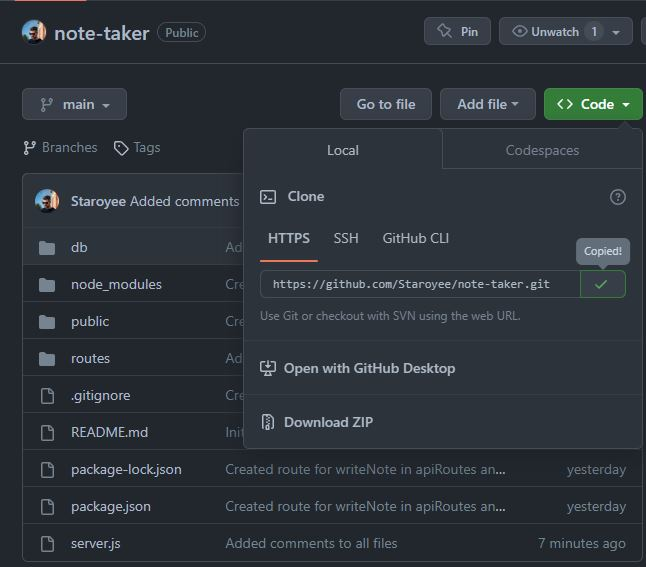
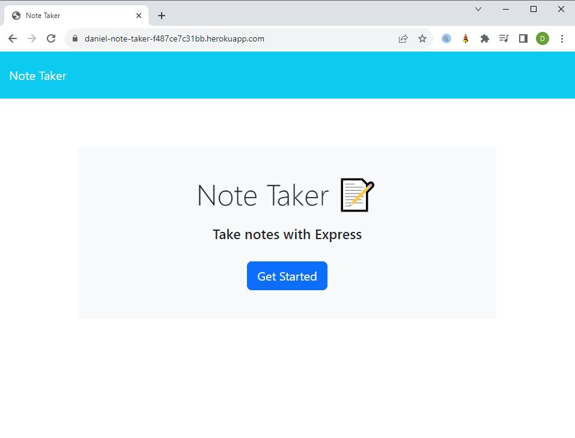
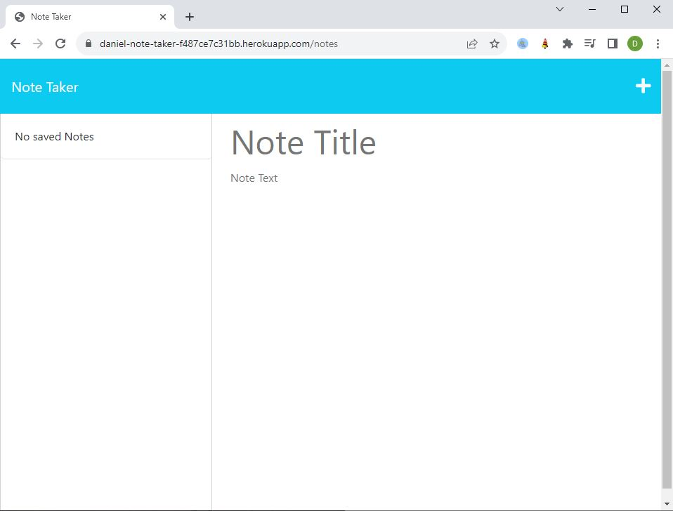
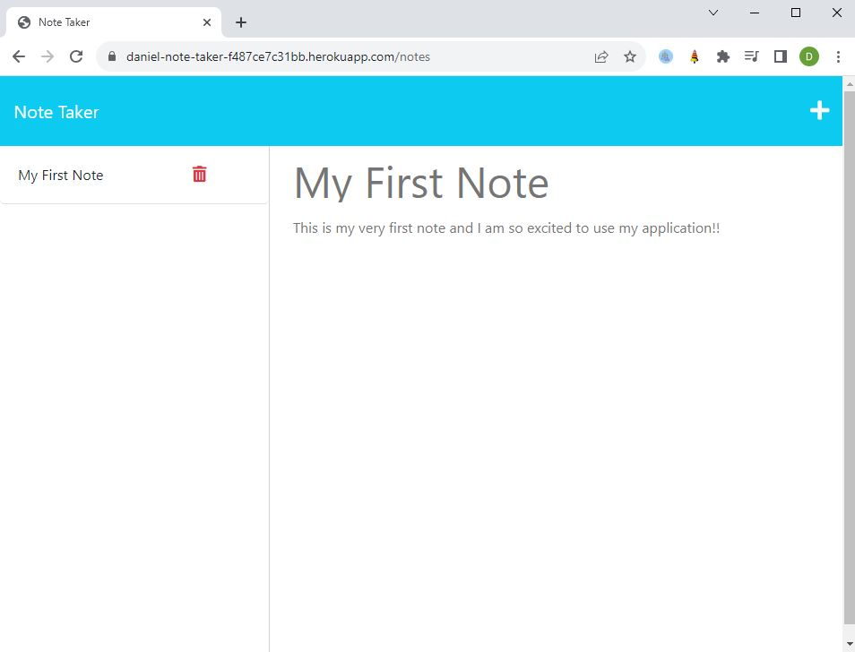

# Note-Taker

## Description
I was tasked to create the back end of a note-taker application so that it would function properly, then deploy the application to Heroku.

I was motivated to undertake this task because I wished to gain a greater understanding of express.js modular routing, asynchronous functions, and Heroku deployments.

## Solve
The completion of this project provides the user with a functional note-taker application that allows the user to create, save and delete notes.

## I have learned:
* How to use JavaScript within node.js.
* How to use object oriented programming, and imporing/exporting modules.
* Modular routing methods.
* Express.js.
* Heroku.

## Installation
Steps to install this project on your local PC
1. Open the termal on your machine.
2. Use the terminal command `cd` to navigate to the directory where we want the repository located.
3. Locate the 'Code' button on the 'note-taker' github repository, click it, then copy the 'HTTPS' link to clipboard. (See image)

4. Use the git command `git clone` followed by the URL copied from Github to clone the repo to our machine.
5. The `git clone` command creates a new directory with the same name as the repository. We navigate into our new directory using `cd`.
6. The repository should now be cloned onto your device and able to be edited in VScode or another editing software.
7. Install the NPM dependencies by opening the terminal in the index.js file and running the command 'npm i'.

## Deployed Heroku App Link
https://daniel-note-taker-f487ce7c31bb.herokuapp.com/

## Instructions

To use the app:
1. Open app link above.
2. Click 'Get Started'.
3. Enter note title and note text and click the save button.
4. Click on an existing note to recall the note.
5. Click the delete button to delete notes.

## Screenshot

## Credits
* Week 9 activities
* Week 10 activities.
* Week 11 activities.
* https://developer.mozilla.org/en-US/docs/Web/JavaScript/Reference/Classes
* https://nodejs.org/api/fs.html
* https://nodejs.org/docs/latest-v18.x/api/
* https://stackoverflow.com/questions/18864677/what-is-process-env-port-in-node-js
* https://expressjs.com/en/guide/routing.html
* https://medium.com/@zachcaceres/child-routers-in-express-56f904597b1b